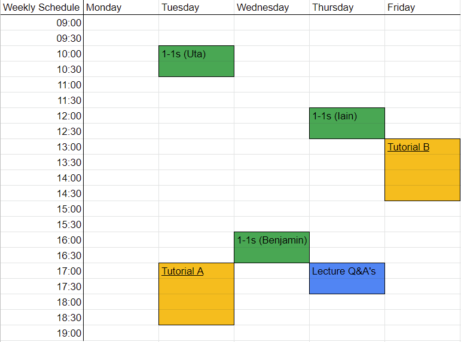

# Course Content 

This page contains links to 
* resouces, 
* the [course content](#course-organisation) for the individual weeks as well as, 
* the [schedule](#timetable). 

## What Am I Supposed To Do During a Week? 

Each week has a [topic](#course-organisation). All of that written below is optional, and serves as a guide to planning your work:

* watch the video lectures (with accompanying slides) (~1h)
* browse any recommended reading material (~1h)
* participate in the [weekly tutorial](#timetable) on [Teams](https://bit.ly/dv4p2022) (2h). <!-- There is a channel for each tutorial group A and B. Sessions are recorded (recordings will automatially appear in the channel); tutorial scripts are linked from the schedule. -->
* book and attend a 1-1 meeting with one of us. <!-- TODO - insert link? -->
* submit the week's quizzes via Teams and check your answers against the sample solutions (~1h)
* attend the [Q&A sessions](#timetable) in the dedicated channel on Teams. Q&A sessions are also recorded.
* submit any relevant milestone assignments on [Teams](https://bit.ly/dv4p2022).

 

## Resources & Important Links

Resources you may need during the course. 

* **[Teams](https://bit.ly/dv4p2022):** **note** you must be logged in to your Edinburgh Office365 account for this course for this link to work.   
<!-- * **[Book 1-on-1](https://datavisonline.youcanbook.me)**. The booking link will lapse from the end of each week's bookings, AND work again from Tues 14:00 when new bookings are available -->

* **[MyEd portal](https://www.myed.ed.ac.uk)**   
* **[Library](https://discovered.ed.ac.uk)** to obtain copies of books and papers. 

* **[Noteable - University of Edinburgh Jupyter Notebook](https://noteable.edina.ac.uk/launch)**. The site provides an environment for Jupyter Notebooks.  
* **[University software services](https://www.ed.ac.uk/information-services/computing/desktop-personal/software)**
* **[University IT helpdesk](https://www.ed.ac.uk/information-services/help-consultancy/contact-helpline)**

* **[VisGuides open discussion forum](https://visguides.org/)** about visualisation guidelines  
* **[Books](https://visualinteractivedata.github.io/res-books)** about visualization
* **[Blogs and Collections](https://visualinteractivedata.github.io/res-collections.html)** about visualization.
 

## Recommended Books for the Course: 

* Tamara Munzner (2014) Visualization Analysis and Design: [UoE library link](https://discovered.ed.ac.uk/permalink/f/1njkql8/44UOE_ALMA51246510430002466)
* Alberto Cairo (2013) The Functional Art: An introduction to information graphics and visualization (Voices That Matter): [PDF preview pages](https://ptgmedia.pearsoncmg.com/images/9780321834737/samplepages/0321834739.pdf) &nbsp;|&nbsp; [UoE Library Link &mdash; hard copy](https://discovered.ed.ac.uk/permalink/f/gfso8q/44UOE_ALMA21114830170002466) &nbsp;|&nbsp; [UoE Library Link &mdash; soft copy](https://discovered.ed.ac.uk/permalink/f/gfso8q/44UOE_ALMA51285758880002466)
* Andy Kirk (2019) Data Visualization: A Handbook for Data Driven Design: [digital companion site](http://book.visualisingdata.com).

## [Assessment Guidelines](assessment.md)

In addition to the final project, the course has **two** milestone [assignments](assessment.md). While optional, feedback will only be provided if they are submitted before their respective deadlines.
The final project is the only mandatory assignment.

## [Tutorial Guidelines](tutorials.md)

Please remember that while **strongly encouraged**, participation in tutorials and all other interactive sessions is **optional**. Please read the [guidelines](tutorials.md) before attending your first interactive session; these take into account feedback from interaction with participants and the constraints inherent to a virtual classroom. 

***

## Course Organisation

<table>

  <tr>
    <th>Session</th>
    <th>Lectures</th>
    <th>Tutorial</th>
    <th>Assessment</th>
  </tr>

  <tr style = "vertical-align:top;">
    <th colspan = "4"><h4>Week 0 &ndash; May 9</h4></th>
  </tr>
  <tr style = "vertical-align:top;">
   <td><a href="session-0">0</a></td>
   <td><a href="session-0">Course introduction</a></td>
   <td>-</td>
   <td>-</td>
  </tr>

  <tr style = "vertical-align:top;">
    <th colspan = "4"><h4>Week 1 &ndash; May 16</h4></th>
  </tr>
  <tr style = "vertical-align:top;">
   <td><a href="session-1">1</a></td>
   <td>
      <a href="session-1#lecture">Datavis introduction  &amp; Basic concepts</a>
    </td>
    <td>
      <a href="session-1#tutorial-real-life">Datavis in Real Life</a> 
      <a href="session-1#tutorial-vis_lies">Visualisation lies</a> 
      <a href="session-1-2#tutorial-project_brief">Formulating data visualisation brief</a> 
    </td>
    <td>-</td>
  </tr>
 
  <tr style = "vertical-align:top;">
    <th colspan = "4"><h4>Week 2 &ndash; May 23</h4></th>
  </tr><tr style = "vertical-align:top;">
   <td><a href="session-2">2</a></td>
   <td>
      <a href="session-2#lecture">Visualization Design</a> 
    </td><td>
      <a href="session-2#tutorial-fortyfive-ways">45 ways</a> 
      <a href="session-2#tutorial-design-sketching">Design (Sketching)</a> 
    </td><td>
      <a href="session-2#assignment">Project brief</a>
    </td>
  </tr>
 
  <tr style = "vertical-align:top;">
     <th colspan = "4"><h4>Week 3 &ndash; May 30</h4></th>
  </tr><tr style = "vertical-align:top;">
   <td><a href="session-3">3</a></td>
    <td>
       <a href="session-3#lecture">Visualization Tools</a> 
    </td><td>
      <a href="session-3#tutorial-tool-marketplace">Visualisation tools marketplace</a> 
      <a href="session-3#tutorial-tools-discussion">Visualisation tools discussion</a> 
    </td><td>
     -
    </td>
  </tr>
  
  <tr style = "vertical-align:top;">
    <th colspan = "4"><h4>Week 4 &ndash; Jun 6</h4></th>
  </tr><tr style = "vertical-align:top;">
    <td><a href="session-4">4</a></td>
    <td style = "vertical-align:top;">
      <a href="session-4#lecture">Visualization Techniques I/II</a> 
    </td><td>
      Tool tutorials
    </td><td>
      Sketches
    </td>
  </tr>
  
  <tr style = "vertical-align:top;">
    <th colspan = "4"><h4>Week 5 &ndash; Jun 13</h4></th>
  </tr><tr style = "vertical-align:top;">
    <td><a href="session-5">5</a></td>
    <td style = "vertical-align:top;">
      <a href="session-5#lecture">Visualization Techniques II/II</a> 
    </td><td>
      Tool tutorials
    </td><td>
      -
    </td>
  </tr>
  
  <tr style = "vertical-align:top;">
    <th colspan = "4"><h4>Week 6 &ndash; Jun 20</h4></th>
  </tr><tr style = "vertical-align:top;">
    <td><a href="session-6">6</a></td>
    <td style = "vertical-align:top;">
      <a href="session-6#lecture">Storytelling</a>
    </td><td>
      <a href="session-6#design-data-comics">Storyboarding</a>
    </td><td>
    </td>
  </tr>
  
  <tr style = "vertical-align:top;">
    <th colspan = "4"><h4>Week 7 &ndash; Jun 27</h4></th>
  </tr><tr style = "vertical-align:top;">
    <td><a href="session-7">7</a></td>
    <td style = "vertical-align:top;">
      <a href="session-7#lecture">Evaluation &amp; Interaction Design</a>
    </td><td>
       <a href="session-7#tutorial-programming_clinic">Evaluation</a>
    </td><td>
    </td>
  </tr>
  
  <tr style = "vertical-align:top;">
    <th colspan = "4"><h4>Week 8 &ndash; Jul 4</h4></th>
  </tr><tr style = "vertical-align:top;">
    <td><a href="session-8">8</a></td>
    <td style = "vertical-align:top;">
      Project 1-on-1s
    </td>
    <td>-</td>
    <td>Final Project</td>
  </tr>
  
</table>

&nbsp;

***

## Timetable

* __Note all times are BST__
* The Lecture Q&A is an opportunity for you to ask any question about course content and quizzes, and engage in public discussions with all of the participants. The content of these sessions depends on the participants asking questions.
* 1-1s can be [booked in Teams](https://teams.microsoft.com/l/channel/19%3AOIRJwBBQHoGVsHuc3GveG-GaMvHyiNQMHVSoshtsaW01%40thread.tacv2/tab%3A%3Ac854bf64-e00b-449a-b79b-6ed2eda4abf4?groupId=e9b0f008-fac6-4d08-8921-72e502acb356&tenantId=2e9f06b0-1669-4589-8789-10a06934dc61).

